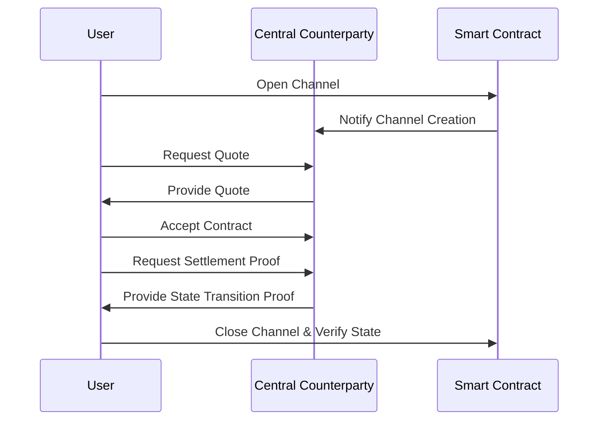
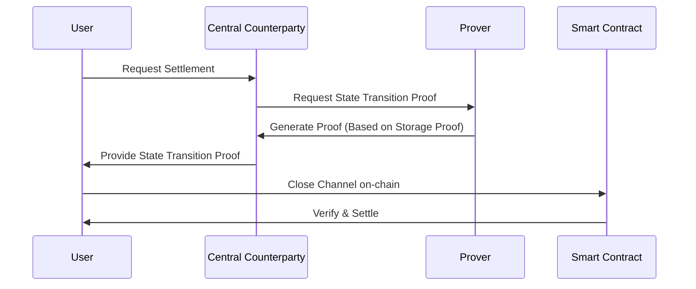

# Central Counterparty State Channels Protocol

This repository contains the implementation of the Central Counterparty (CC) State Channels Protocol, designed to address scalability issues on Ethereum by leveraging state channels for hyper-scalable applications. The protocol ensures integrity, liveness, delayed composability, and operates under a trust-minimized framework.

## Overview

The CC State Channels Protocol introduces a novel approach to Ethereum scalability by enabling private channels between users and a centralized counterparty (broker). This design facilitates efficient and transparent interactions, significantly reducing operational costs associated with gas fees, and ensuring resilience against counterparty defaults.

### Features

- **Counterparty Default Resilience**: Safe channel exit mechanisms in case of defaults.
- **Operational Efficiency**: Minimized operational costs for users.
- **Transparency**: Full visibility of all channel actions for both parties.
- **Delayed Composability**: Settlements can be delayed, allowing for flexible contract execution.
- **Trust Minimized Design**: Ensures security and integrity without relying on trust.

## Workflow Diagrams

### Channel Lifecycle

### Settlement with Storage Proofs

Storage proofs enable the retrieval of historical data, allowing for the settlement of contracts within the state channel without needing to close it. This mechanism permits delayed settlements, expanding the flexibility and efficiency of contract execution.

### Example Use Case

A user enters a futures contract with a broker, with the settlement facilitated through storage proofs. This allows the price at contract expiry to be determined at a later date, enabling settlements to occur within the channel.

## Channel Workflow

The process involves several steps from channel opening, quote request, contract acceptance, to settlement preparation, and eventual closure. Each step is designed to ensure transparency, security, and efficiency.

## Infinitely Opened Channels through IVC

Inter-Virtual Channels (IVC) enhance scalability and efficiency by allowing multiple unsettled transactions within the channel, reducing the need for on-chain verification of each transaction.

## Wallet-less Applications and Transaction History

The design supports wallet-less interactions and off-chain storage of transaction history, enhancing user experience and security.

## Delayed Channel Closure

A delay mechanism in channel closure prevents fraudulent withdrawals, ensuring that the final state reflects all transactions accurately.

## Timestamping and CC Solvency

Introducing a timestamping authority addresses the issue of determining settlement times for contracts without a predefined expiry. Monitoring the solvency of the CC is crucial to maintaining the system's integrity, with the application frontend playing a significant role in evaluating the CC's financial health.

## Herodotus Contribution

Herodotus provides essential components like storage proof codebases, historical blockhash accumulator, and a Cairo verifier on Starknet, enabling the practical implementation of this design.

## Conclusion

The proposed Central Counterparty State Channels offer a scalable, efficient, and secure framework for building applications on Ethereum. By addressing the challenges of shared state management, operational costs, and transparency, this design paves the way for the next generation of decentralized applications.
